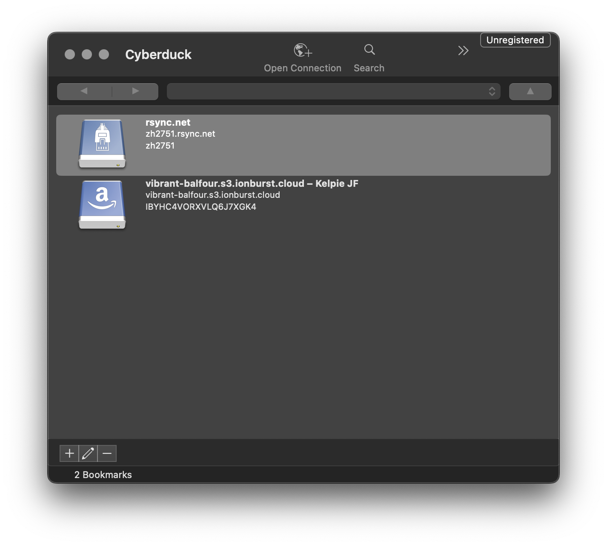
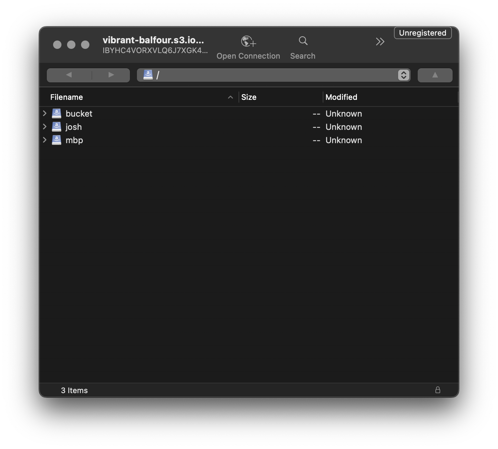

# Ionburst Cloud & Kelpie Instructions

## Installing Cyberduck

To use your Kelpie instance, please download the Cyberduck tool:

- For Windows users: [https://update.cyberduck.io/windows/Cyberduck-Installer-8.5.8.39606.exe](https://update.cyberduck.io/windows/Cyberduck-Installer-8.5.8.39606.exe)
- For Mac users: [https://update.cyberduck.io/Cyberduck-8.5.8.39606.zip](https://update.cyberduck.io/Cyberduck-8.5.8.39606.zip)
- For Mac users with Homebrew: `brew install --cask cyberduck`

In the config pack sent over separately, there will be:

- a `.cyberduckprofile` file - this contains the "bookmark" for your Kelpie instance - Cyberduck uses "bookmarks" to record storage instances
- a credentials file - containing the access key and secret key to add to the "bookmark"

## Configuring Cyberduck

Before adding the Cyberduck profile, the following configuration items should be changed to ensure Kelpie uses Ionburst Cloud efficiently.

The configuration items to be changed cover:

- setting the multipart chunk size to 50MB
- setting the multipart threshold to 50MB
- disabling "segmented downloads"

After updating these settings, Cyberduck must be **fully restarted**.

### Mac

#### Multipart upload settings

Open a terminal, and type/paste the following to set the multipart options:

```
defaults write ~/Library/Preferences/ch.sudo.cyberduck.plist s3.upload.multipart.size 50000000
```

```
defaults write ~/Library/Preferences/ch.sudo.cyberduck.plist s3.upload.multipart.threshold 50000000
```

These options can be verified by typing/pasting:

```
defaults read ~/Library/Preferences/ch.sudo.cyberduck.plist | grep "s3.upload.multipart"
```

#### Segmented download settings

Open the Cyberduck application, then open settings from the Cyberduck menu bar:


In the settings window, navigate to the "Transfers" tab, and un-check the "Segmented downloads with multiple connections per file" option under "Downloads":


### Windows

#### Multipart upload settings

Create a new file `default.properties` in the %AppData%\Cyberduck folder, either manually, or with the following:

```
notepad.exe $Env:AppData\Cyberduck\default.properties
```

Notepad will ask if you want to create a new file, select "Yes", and paste the following:

```
s3.upload.multipart.size=50000000
s3.upload.multipart.threshold=50000000
```

#### Segmented download settings

Open the Cyberduck application, then open "Preferences" from the Cyberduck edit menu.

In the Preferences window, navigate to the "Transfers" tab, and un-check the "Segmented downloads with multiple connections per file" option under "Downloads":


## Adding the Kelpie profile

To add your Kelpie bookmark, double-click the `.cyberduckprofile` file in your config pack. This will open a window that looks like the following:


The server URI for your Kelpie instance will already be filled in. Using the credentials file provided in your config pack, add the Access Key to the "Access Key ID" field, and the Secret Key to the "Secret Access Key" field.

Once these details are added, you can safely close the window. In the main Cyberduck window, you should now see a bookmark entry for your Kelpie instance:



To access your Kelpie instance, double-click the "bookmark". This may throw up an additional authentication window, if so, paste your Secret Key into the empty field again to authenticate. Mac users can check the "Add to Keychain" box to save these credentials:


## Using Cyberduck

Once opened, the Kelpie instance will displayed like so in Cyberduck:



On first use, this window will be blank. As the "root" of the Kelpie instance, this is where we'll add our buckets.

### Creating a Bucket

To create a bucket, right-click in the Cyberduck window, and select "New Folder". In this window, enter your bucket name (must be 3 characters or longer), and click "Create".


### Adding Files

With your bucket created, you can start adding files. Navigate into your bucket in the Cyberduck window, and from here you can either right-click and select "Upload", or drag files directly into Cyberduck window.

Once files have been chosen for upload, Cyberduck will open a "Transfers" window that shows upload and download progress:


Upon successful upload, the file will appear in your bucket in the Cyberduck window:


### Retrieving Files

Much like uploads, downloads from a Kelpie bucket can either be done by right-clicking on the file(s) in the bucket and selecting "Download" (or "Download As" to change the name, or "Download To" to change the download location), or dragging the file(s) from the Cyberduck window to a folder on your local machine.

Any files downloaded from a Kelpie bucket will appear in the Cyberduck "Transfers" window:


### Deleting Files

To delete files from a Kelpie bucket, right-click the file(s) in the Cyberduck window and select "Delete". This will open a confirmation window, select "Delete" to confirm deletion:


## Other Functionality

More advanced Cyberduck functionality hasn't been fully tested, if you find any issues or errors, just shout!